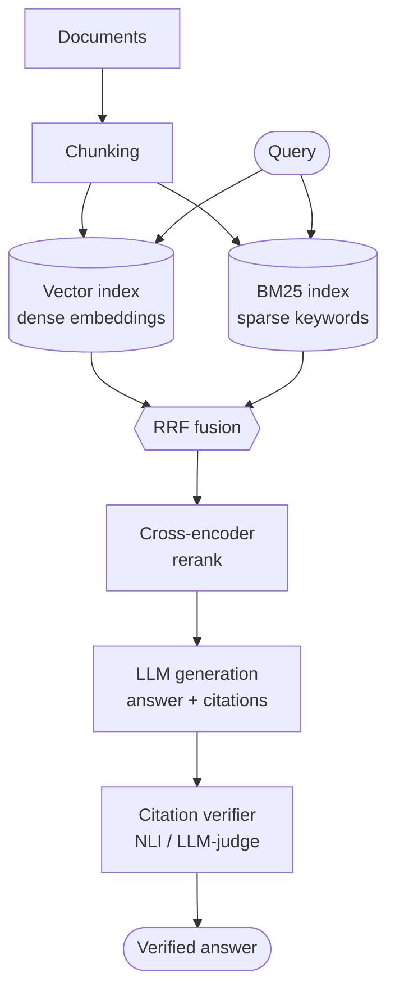

# Hybrid-Search RAG with Citation Verification


A from-scratch retrieval-augmented generation (RAG) system that combines **dense
vector search** and **BM25 keyword search**, reranks the results with a
**cross-encoder**, and then runs a **citation-verification pass** that checks
every claim in the generated answer against the source it cites.

That last step is the point of the project. Most RAG demos stop at "retrieve,
then generate" and quietly trust that the model's citations are real. This one
treats a citation as a claim to be verified, not a decoration — the quality
layer that separates a demo from something you'd actually rely on.

> This is a learning build, implemented one phase at a time. Phases 0–9 are
> complete and measured: the pipeline runs end to end over a 20-document World Cup
> corpus, and every component was evaluated rather than assumed useful — see
> [Evaluation](#evaluation) for the ablation table, including the result that
> *didn't* match expectations. See the [Build roadmap](#build-roadmap) for status.

---

## Table of contents

- [Why this project](#why-this-project)
- [Architecture](#architecture)
- [Key concepts](#key-concepts)
- [Project structure](#project-structure)
- [Getting started](#getting-started)
- [Usage](#usage)
- [Configuration](#configuration)
- [Build roadmap](#build-roadmap)
- [Evaluation](#evaluation)
- [Tech stack and model choices](#tech-stack-and-model-choices)
- [Extensions](#extensions)
- [References](#references)
- [License](#license)

---

## Why this project

A RAG system can fail in exactly two ways:

1. **Retrieval failure** — the right context was never fetched. Nothing
   downstream can fix this.
2. **Generation failure** — the right context *was* fetched, but the model
   produced something wrong or unsupported by it.

This project attacks both. Hybrid search plus cross-encoder reranking maximize
the odds of retrieving the right passages (attacking failure 1). The
citation-verification pass catches the model when it states something the
retrieved text does not actually support (attacking failure 2).

## Architecture

Indexing happens once, offline. Everything from **Query** downward runs per
request against the pre-built indexes.



The flow, stage by stage:

| Stage | What it does | Why it's there |
| --- | --- | --- |
| Chunking | Splits documents into small, citable passages with stable IDs | Retrieval precision and fine-grained citations |
| Dense retrieval | Embeds query + chunks, finds nearest neighbours | Catches paraphrases and semantic matches |
| Sparse retrieval (BM25) | Keyword scoring over the same chunks | Catches exact terms: names, codes, rare words |
| RRF fusion | Merges the two ranked lists by rank, not raw score | Combines their complementary strengths |
| Cross-encoder rerank | Re-scores the fused pool jointly on (query, passage) | High-precision ordering of the final few |
| LLM generation | Answers from the reranked passages, citing by chunk | Grounded answer with a parseable claim→source map |
| Citation verifier | Checks each claim against its cited chunk (NLI / LLM-judge) | Flags or removes unsupported claims |

## Key concepts

**Hybrid search.** Dense (embedding) retrieval understands meaning but blurs
exact tokens; sparse (BM25) retrieval nails exact tokens but misses paraphrases.
They fail on different queries, so using both and merging beats either alone.

**Reciprocal Rank Fusion (RRF).** Dense scores (cosine, roughly 0–1) and BM25
scores (unbounded) are not comparable, so you cannot simply add them. RRF uses
only the *rank* of each result:

```
rrf_score(d) = Σ  1 / (k + rank_i(d))       # over each retriever i, with k ≈ 60
```

**Cross-encoder reranking.** A bi-encoder embeds query and document separately
(fast, but never sees them together). A cross-encoder feeds `(query, document)`
through the model jointly and scores their relevance directly — much more
accurate, but too slow to run over a whole corpus. So it runs only on the fused
candidate pool. This two-stage pattern (cheap wide recall → expensive precise
rerank) is standard in production RAG.

**Citation verification.** "Does chunk *X* support claim *Y*?" is a Natural
Language Inference (NLI) problem: with premise = cited chunk and hypothesis =
claim, classify entailment / neutral / contradiction. Two interchangeable
implementations are included as a design choice to compare:

- an **NLI cross-encoder** — fast, cheap, deterministic entailment scores;
- an **LLM-as-judge** — flexible on paraphrase, but needs a strict rubric to
  avoid rating loosely-related text as "supported".

Compound sentences are decomposed into atomic claims first, and each claim is
checked against *its cited chunk* — which is what catches a citation that points
to the wrong source.

## Project structure

```
hybrid-rag-citation-verification/
├── README.md
├── requirements.txt
├── pyproject.toml            # makes `rag` / `evaluation` importable (pip install -e .)
├── .gitignore
├── .env.example              # copy to .env for API keys (Phase 6+)
├── data/
│   └── corpus/               # 20 World Cup documents (.md)
├── rag/
│   ├── config.py             # Config dataclass + the shared bi-encoder
│   ├── ingest.py             # load_corpus() [Phase 0] + chunk_documents() [Phase 1]
│   ├── dense.py              # DenseIndex               [Phase 2]
│   ├── sparse.py             # SparseIndex (BM25)       [Phase 3]
│   ├── fuse.py               # reciprocal_rank_fusion   [Phase 4]
│   ├── rerank.py             # Reranker (cross-encoder) [Phase 5]
│   ├── generate.py           # generate() + citation resolution [Phase 6]
│   ├── verify.py             # NLIVerifier + LLMJudge   [Phase 7]
│   └── pipeline.py           # Pipeline.answer()        [Phase 8]
├── evaluation/
│   ├── eval_set.py           # 30 labelled query -> gold chunk_id pairs
│   ├── metrics.py            # recall@k, MRR, nDCG, the ablation  [Phase 9]
│   └── FINDINGS.md           # filled tables + written analysis
└── scripts/
    └── check_setup.py        # Phase 0 checkpoint
```

Every stage is a small module with a clean input→output interface, so stages are
independently testable and swappable. That paid off concretely when generation
switched LLM provider: only the transport inside `generate()` changed, while
context building and citation resolution carried over untouched. Each module has a
`__main__` block that runs its own phase checkpoint.

## Getting started

### Prerequisites

- Python 3.11 or newer
- (Phase 6+) a `GROQ_API_KEY` in `.env` — generation and the LLM-judge verifier
  run on Groq. Retrieval, reranking and the NLI verifier are all local and need
  no key.

### Install

```bash
git clone https://github.com/<you>/hybrid-rag-citation-verification.git
cd hybrid-rag-citation-verification

python -m venv .venv
source .venv/bin/activate          # Windows: .venv\Scripts\activate

# Phase 0 needs nothing installed. For Phase 1+:
pip install -r requirements.txt
pip install -e .                   # optional but recommended: makes `import rag` work anywhere
```

### Run the Phase 0 checkpoint

This uses only the standard library, so you can run it before installing
anything:

```bash
python scripts/check_setup.py
```

Expected output: it loads the sample corpus, prints a preview of a few
documents, confirms document IDs are deterministic, and reports the checkpoint
as passed.

### Use your own corpus

Drop `.md`, `.txt`, or `.json` files into `data/corpus/` and re-run the check.
For `.json`, provide either a single `{"text": ..., "id": ..., "source": ...}`
object or a list of them. Start small — 20 to 200 documents on a topic you know
well, so you can tell when an answer is wrong.

## Usage

Set `GROQ_API_KEY` in a `.env` file (needed from Phase 6 onward), then:

```python
from rag.pipeline import Pipeline

# Build the indexes once (chunk -> embed + BM25) and load the models.
pipeline = Pipeline().build()

result = pipeline.answer("Who is the all-time top scorer in World Cup history?")

print(result.answer)                      # "Miroslav Klose is the all-time leading..."
print(f"faithfulness: {result.faithfulness:.2f}")
for claim in result.verified_claims:
    print(f"  [supported {claim.score:.2f}] {claim.claim}")
for claim in result.unsupported_claims:
    print(f"  [UNSUPPORTED] {claim.claim}")

# result.debug holds every stage's intermediate output — the ranked lists from
# each retriever, the fused pool, the reranked top-n, the claims with their
# citations, and every verdict. When an answer is wrong, this is how you find
# which stage broke.
```

Each module also runs standalone as its own checkpoint, e.g.
`python rag/pipeline.py` traces several queries end to end, and
`python evaluation/metrics.py` reproduces the ablation table below.

## Configuration

All knobs live in [`rag/config.py`](rag/config.py). Change a value, re-run,
compare — that is the experiment loop.

| Setting | Default | Phase | Purpose |
| --- | --- | --- | --- |
| `chunk_size_tokens` | 300 | 1 | Target chunk length |
| `chunk_overlap_tokens` | 45 | 1 | Overlap between chunks (~15%) |
| *embedding model* | `BAAI/bge-small-en-v1.5` | 2 | Bi-encoder, loaded once in `config.py` |
| `k_each` | 10 | 2/3 | Candidates retrieved *per retriever* |
| `rrf_k` | 60 | 4 | RRF constant |
| `fusion_pool_size` | 20 | 4 | Candidates handed to the reranker |
| *reranker model* | `ms-marco-MiniLM-L-6-v2` | 5 | Cross-encoder reranker |
| `rerank_top_n` | 5 | 5 | Passages sent to the LLM |
| `llm_model` | `openai/gpt-oss-120b` | 6 | Generation model (via Groq) |
| `verifier` | `nli` | 7 | `nli` (local, free) or `llm-judge` |
| `verify_threshold` | 0.5 | 7 | Min entailment score to accept a claim |

`k_each` and `fusion_pool_size` are smaller than a production setup would use
because the corpus is only 21 chunks — retrieving 50 per retriever would return
the entire corpus and make fusion meaningless.

## Build roadmap

Each phase depends on the last. For every phase: learn the concepts, implement
the stub, then run its checkpoint before moving on.

- [x] **Phase 0 — Setup.** Environment, project skeleton, corpus loader.
- [x] **Phase 1 — Chunking.** Recursive splitting, overlap, stable chunk IDs.
- [x] **Phase 2 — Dense retrieval.** Embeddings, cosine similarity, ANN.
- [x] **Phase 3 — Sparse retrieval.** BM25, tokenization, exact-match strength.
- [x] **Phase 4 — Hybrid fusion.** Reciprocal Rank Fusion.
- [x] **Phase 5 — Reranking.** Cross-encoder, the two-stage pattern.
- [x] **Phase 6 — Generation.** Grounded answers with parseable citations.
- [x] **Phase 7 — Verification.** NLI and LLM-judge; claim decomposition.
- [x] **Phase 8 — Pipeline.** Wire it together with a debug trace.
- [x] **Phase 9 — Evaluation.** Retrieval metrics, faithfulness, the ablation table.
- [ ] **Phase 10 — Iterate.** Query rewriting, parent-doc retrieval, context ordering.

## Evaluation

Evaluation has two halves: did retrieval fetch the right chunks, and did
generation use them faithfully.

**Retrieval** is measured against a small labelled set of `query → gold
chunk_id(s)` using Recall@k, MRR, and nDCG@k. The payoff is an ablation table
that proves each component earns its place:

Measured on 30 labelled queries (8 paraphrase, 11 exact-term, 11 factual) over a
21-chunk corpus:

| Config | Recall@10 | MRR | nDCG@10 | Recall@1 | nDCG@5 |
| --- | --- | --- | --- | --- | --- |
| Dense only | 0.933 | 0.668 | 0.723 | 0.567 | 0.672 |
| Sparse only (BM25) | **1.000** | **0.923** | **0.937** | **0.900** | **0.931** |
| Hybrid (RRF) | 0.967 | 0.832 | 0.860 | 0.733 | 0.860 |
| Hybrid + rerank | 0.967 | 0.872 | 0.892 | 0.800 | 0.892 |

> **Read the `@10` columns with care at this corpus size.** Ten results is half of
> a 21-chunk corpus, so Recall@10 compresses into 0.93–1.00 and barely separates
> the configs. `hybrid + rerank` also returns only 5 passages by design, so it can
> never score a hit at ranks 6–10. **Recall@1 and MRR are the columns with signal
> here**, which is why they are included.

Expected story: hybrid ≥ either single method, and reranking lifts precision the
most. **That is not what happened** — sparse-only won outright. The cause is eval
set composition, not a fusion bug: 22 of the 30 queries are proper-noun or
rare-token shaped, which is BM25's home turf (a perfect 1.000 MRR on exact-term
queries). RRF is a democratic average, so it cannot beat a dominant expert on that
expert's ground. It *does* win the paraphrase category it exists for (0.802 vs
0.795 dense / 0.781 sparse), but only 8 queries have that shape. Reranking did
earn its place, improving every metric over hybrid.

Full per-category breakdown and analysis: [`evaluation/FINDINGS.md`](evaluation/FINDINGS.md).

**Verifier accuracy** on 20 labelled `(claim, chunk, supported?)` triples, with
"supported" as the positive class:

| Verifier | Precision | Recall | F1 | Accuracy |
| --- | --- | --- | --- | --- |
| NLI (`nli-deberta-v3-base`) | **1.000** | 0.600 | 0.750 | 0.800 |
| LLM-judge (`gpt-oss-120b`) | **1.000** | 1.000 | 1.000 | 1.000 |

Both reach **perfect precision — zero false positives.** That is the number this
project cares about: a false positive is an unsupported claim reaching the user.
They differ in recall — the NLI model errs strict, flagging 4 of 10 genuinely
supported claims. The judge's flawless score deserves suspicion rather than
celebration: 20 claims is a small set, and it shares a model family with the
generator, so self-agreement likely inflates it.

**Generation** is measured with faithfulness (are claims grounded?), answer
relevance, and context precision/recall. [RAGAS](https://github.com/explodinggradients/ragas)
computes these reference-free by decomposing answers into claims and verifying
each against context — essentially an automated, at-scale version of the
verifier built by hand in Phase 7.

## Tech stack and model choices

Chosen to run on a laptop (CPU is fine) and to be simple enough to learn from.
Every choice is swappable — leaderboards move, the concepts don't, so always
test on your own data.

| Component | In use here | Upgrade path |
| --- | --- | --- |
| Embeddings | `BAAI/bge-small-en-v1.5` | `bge-m3` |
| Vector index | numpy brute-force | `faiss-cpu`, `chromadb` |
| Sparse | `rank_bm25` | `bm25s` |
| Reranker | `ms-marco-MiniLM-L-6-v2` | `bge-reranker-v2-m3` |
| Generation | `openai/gpt-oss-120b` via Groq | any provider — only the transport is coupled |
| NLI verifier | `nli-deberta-v3-base` | fact-verification models, LLM-judge |
| Evaluation | hand-rolled metrics | `ragas`, `deepeval` |

BGE was chosen over `all-MiniLM-L6-v2` for retrieval quality, at the cost of
needing a query instruction prefix — omit it and recall drops silently.
`gpt-oss-120b` was picked because it is the only model on this Groq account that
supports **strict `json_schema`** output, which is what makes citations
guaranteed-parseable rather than regex-scraped.

## Extensions

Once the core works, each of these is a self-contained follow-up: query
rewriting / multi-query / HyDE; parent-document or sentence-window retrieval
(retrieve small, feed larger context); context ordering to counter "lost in the
middle"; caching and streaming; and a small web UI.

## References

- Karpukhin et al., *Dense Passage Retrieval* (DPR)
- Robertson & Zaragoza, *The Probabilistic Relevance Framework* (BM25)
- Cormack et al., 2009, *Reciprocal Rank Fusion*
- The [sentence-transformers](https://www.sbert.net/) documentation (cross-encoders)
- Es et al., 2024, *RAGAS*; and the *ALCE* benchmark on citation quality
- Liu et al., *Lost in the Middle*

## License

MIT — see below. The sample documents in `data/corpus/` are original content
written for this repository and are released under the same license.
